# 📋 Rencana Implementasi — Fitur Fase 1 yang Belum Dikembangkan

**Project:** Omah System · **Versi PRD:** 0.6  
**Tanggal:** 2 Oktober 2026

---

## Status Saat Ini (✅ Selesai)

| Modul | Status | Catatan |
|-------|--------|---------|
| Auth + Household + Undangan | ✅ Selesai | Token SHA-256, batas 2 anggota |
| Dashboard (Keuangan + Aktivitas) | ✅ Selesai | Dual-tab, stat cluster, quick-add |
| Transaksi (CRUD + Filter) | ✅ Selesai | Input <10 detik, soft delete |
| Dompet (Saldo Dinamis) | ✅ Selesai | Dihitung dari opening_balance + tx |
| Kategori (Default + CRUD) | ✅ Selesai | Expense/Income, arsip |
| Daftar Belanja (Checklist) | ✅ Selesai | Real-time checklist |
| Tugas Rumah (CRUD + Filter) | ✅ Selesai | Assignee, due date, recurrence |
| Telegram Bot (Webhook) | ✅ Selesai | /saldo, /tagihan, /tugas |
| Cron Harian (Pengingat) | ✅ Selesai | Idempoten, keepalive Supabase |
| Feed iCal | ✅ Selesai | `/api/ical/[token]` |
| Pengaturan | ✅ Selesai | Profil, periode, iCal URL, invite |
| Desain Starbucks Heritage | ✅ Selesai | Tema global konsisten |

---

## Fitur yang Belum Dikembangkan (7 Fitur)

### Ringkasan Prioritas

| # | Fitur | Prioritas | Estimasi | Kompleksitas |
|---|-------|-----------|----------|--------------|
| 1 | Tandai Tagihan "Sudah Bayar" | 🔴 Tinggi | 3-4 jam | Sedang |
| 2 | Kelola Limit Anggaran (Budget) | 🔴 Tinggi | 4-5 jam | Tinggi |
| 3 | Modul Target Tabungan | 🟡 Sedang | 3-4 jam | Sedang |
| 4 | Pengingat Dokumen (STNK/Pajak/dll) | 🟡 Sedang | 4-5 jam | Sedang |
| 5 | Ekspor Data CSV | 🟢 Rendah | 2-3 jam | Rendah |
| 6 | PWA Manifest + Ikon | 🟢 Rendah | 1-2 jam | Rendah |
| 7 | Supabase Realtime Subscription | 🟡 Sedang | 3-4 jam | Tinggi |

**Total Estimasi: ~20-27 jam kerja**

---

## Fitur 1: Tandai Tagihan "Sudah Bayar"

> **Referensi PRD:** §5.1 — "status sudah dibayar untuk jatuh tempo terdekat; opsional otomatis membuat transaksi"  
> **Prioritas:** 🔴 Tinggi — Fitur kritis keuangan, melengkapi alur tagihan berulang

### Deskripsi
Saat tagihan berulang jatuh tempo, pengguna bisa menandai "Sudah Bayar". Sistem update `lastPaidDueDate` dan opsional otomatis membuat transaksi EXPENSE.

### File yang Perlu Dibuat/Diubah

| File | Aksi | Detail |
|------|------|--------|
| [`src/lib/data/bills.ts`](file:///d:/Project%20Website/project-omah/src/lib/data) | **Buat** | Data-access: `markBillPaid(billId, householdId, createTransaction?)` |
| [`src/actions/bill-actions.ts`](file:///d:/Project%20Website/project-omah/src/actions) | **Buat** | Server action: validasi + panggil data layer |
| [`src/components/dashboard/tab-keuangan.tsx`](file:///d:/Project%20Website/project-omah/src/components/dashboard/tab-keuangan.tsx) | **Ubah** | Tambah tombol ✅ "Bayar" di kartu tagihan |
| [`src/components/settings/settings-view.tsx`](file:///d:/Project%20Website/project-omah/src/components/settings/settings-view.tsx) | **Ubah** | Tambah status paid/unpaid di daftar tagihan |
| [`src/lib/data/dashboard.ts`](file:///d:/Project%20Website/project-omah/src/lib/data/dashboard.ts) | **Ubah** | Sertakan `lastPaidDueDate` di response bills |

### Langkah Implementasi

```
1. Buat src/lib/data/bills.ts
   - getBillsForHousehold(householdId)
   - markBillAsPaid(billId, householdId, opts)
     → Update lastPaidDueDate ke tanggal jatuh tempo saat ini
     → Jika opts.createTransaction = true:
       - Buat transaksi EXPENSE dengan amount, categoryId, walletId dari bill
       - Kirim peringatan budget jika melewati 80%/100%
   - Validasi: billId harus milik householdId

2. Buat src/actions/bill-actions.ts
   - markBillPaidAction(formData)
   - Zod schema: { billId, createTransaction, walletId? }

3. Update UI dashboard tab-keuangan.tsx
   - Di setiap kartu tagihan, tampilkan badge:
     - "Sudah Bayar ✅" (hijau) jika lastPaidDueDate >= dueDate periode ini
     - "Belum Bayar" (amber) jika belum
   - Tombol "Tandai Bayar" → modal konfirmasi:
     - Toggle "Otomatis buat transaksi?"
     - Pilih dompet (jika ya)
   - Setelah bayar → revalidatePath("/")

4. Update dashboard.ts data layer
   - Include lastPaidDueDate di response bills
   - Hitung isPaidThisCycle berdasarkan perbandingan lastPaidDueDate vs due date saat ini
```

### Logika Bisnis Kunci

```typescript
// Menentukan apakah tagihan sudah dibayar untuk siklus ini
function isPaidThisCycle(bill: RecurringBill): boolean {
  if (!bill.lastPaidDueDate) return false;
  const currentDueDate = getCurrentDueDate(bill); // tanggal jatuh tempo siklus ini
  return bill.lastPaidDueDate >= currentDueDate;
}
```

---

## Fitur 2: Kelola Limit Anggaran (Budget Management)

> **Referensi PRD:** §5.1 + §6.3 — "batas per kategori yang berlaku sampai diubah, indikator terpakai/sisa, peringatan 80% dan 100%"  
> **Prioritas:** 🔴 Tinggi — Core financial feature

### Deskripsi
UI untuk set/ubah limit anggaran per kategori. Dashboard menampilkan progress bar terpakai vs sisa. Peringatan real-time saat transaksi melewati ambang batas.

### File yang Perlu Dibuat/Diubah

| File | Aksi | Detail |
|------|------|--------|
| [`src/lib/data/budgets.ts`](file:///d:/Project%20Website/project-omah/src/lib/data) | **Buat** | CRUD budget + hitung spent per kategori |
| [`src/actions/budget-actions.ts`](file:///d:/Project%20Website/project-omah/src/actions) | **Buat** | Server action: set/update limit |
| [`src/components/dashboard/budget-overview.tsx`](file:///d:/Project%20Website/project-omah/src/components/dashboard) | **Buat** | Progress bars per kategori |
| [`src/app/budgets/page.tsx`](file:///d:/Project%20Website/project-omah/src/app) | **Buat** | Halaman kelola budget (opsional, bisa di Settings) |
| [`src/components/dashboard/tab-keuangan.tsx`](file:///d:/Project%20Website/project-omah/src/components/dashboard/tab-keuangan.tsx) | **Ubah** | Embed budget-overview di tab Keuangan |
| [`src/actions/transaction-actions.ts`](file:///d:/Project%20Website/project-omah/src/actions/transaction-actions.ts) | **Ubah** | Cek budget threshold setelah simpan transaksi |

### Langkah Implementasi

```
1. Buat src/lib/data/budgets.ts
   - getBudgetsWithSpent(householdId)
     → Untuk setiap kategori EXPENSE:
       - Ambil budget dengan effectiveFrom terbesar <= awal periode saat ini
       - Hitung total spent dari transaksi EXPENSE di periode saat ini
       - Return: { category, limit, spent, percentage, status }
   - upsertBudget(householdId, categoryId, limitAmount)
     → Buat/update budget dengan effectiveFrom = awal periode saat ini
   - Perhatikan period_start_day household untuk menentukan awal/akhir periode

2. Buat src/actions/budget-actions.ts
   - setBudgetLimitAction(formData)
   - Zod: { categoryId, limitAmount: number >= 0 }

3. Buat src/components/dashboard/budget-overview.tsx
   - Tampilkan per kategori:
     - Nama kategori
     - Progress bar (hijau < 80%, amber 80-99%, merah >= 100%)
     - "Rp X / Rp Y" (spent / limit)
     - Persentase
   - Tombol "Atur Limit" → modal inline dengan input nominal

4. Integrasikan ke tab-keuangan.tsx
   - Sisipkan <BudgetOverview> di bawah ringkasan periode
   - Data di-pass dari getDashboardData()

5. Peringatan Budget di transaction-actions.ts
   - Setelah transaksi EXPENSE berhasil disimpan:
     → Hitung ulang spent untuk kategori tersebut
     → Jika melewati 80% atau 100% → kirim Telegram (inline, bukan via cron)
     → Gunakan notification_logs untuk idempotency (slot = 80 atau 100)
```

### Logika Periode Custom

```typescript
// Hitung awal periode berdasarkan periodStartDay
function getPeriodBounds(periodStartDay: number, referenceDate: Date) {
  const year = referenceDate.getFullYear();
  const month = referenceDate.getMonth();
  const day = referenceDate.getDate();
  
  let startMonth = day >= periodStartDay ? month : month - 1;
  let startYear = year;
  if (startMonth < 0) { startMonth = 11; startYear--; }
  
  const periodStart = new Date(startYear, startMonth, periodStartDay);
  const periodEnd = new Date(startYear, startMonth + 1, periodStartDay);
  
  return { periodStart, periodEnd };
}
```

---

## Fitur 3: Modul Target Tabungan

> **Referensi PRD:** §5.1 — "nama target, nominal target, terkumpul, tenggat opsional"  
> **Prioritas:** 🟡 Sedang — Berguna tapi bukan blocker untuk pemakaian harian

### Deskripsi
CRUD target tabungan. savedAmount diisi manual. Tampilkan progress dan estimasi pencapaian.

### File yang Perlu Dibuat/Diubah

| File | Aksi | Detail |
|------|------|--------|
| [`src/lib/data/savings.ts`](file:///d:/Project%20Website/project-omah/src/lib/data) | **Buat** | CRUD savings goals |
| [`src/actions/savings-actions.ts`](file:///d:/Project%20Website/project-omah/src/actions) | **Buat** | Server actions |
| [`src/components/dashboard/savings-card.tsx`](file:///d:/Project%20Website/project-omah/src/components/dashboard) | **Buat** | Kartu ringkasan tabungan di dashboard |
| [`src/app/savings/page.tsx`](file:///d:/Project%20Website/project-omah/src/app) | **Buat** | Halaman kelola tabungan (atau sub-section di Settings) |
| [`src/components/dashboard/tab-keuangan.tsx`](file:///d:/Project%20Website/project-omah/src/components/dashboard/tab-keuangan.tsx) | **Ubah** | Tampilkan ringkasan tabungan |

### Langkah Implementasi

```
1. Buat src/lib/data/savings.ts
   - getSavingsGoals(householdId)
     → where: { householdId, deletedAt: null }
     → Return: id, name, targetAmount, savedAmount, deadline, progress%
   - createSavingsGoal(householdId, data)
   - updateSavedAmount(goalId, householdId, newAmount)
     → Validasi: goalId milik householdId
   - deleteSavingsGoal(goalId, householdId) → soft delete

2. Buat src/actions/savings-actions.ts
   - createSavingsGoalAction(formData)
   - updateSavedAmountAction(formData)
   - deleteSavingsGoalAction(formData)
   - Zod schemas

3. Buat UI components
   - savings-card.tsx (dashboard ringkasan):
     - Progress ring/bar per target
     - "Rp X / Rp Y" (terkumpul / target)
     - Estimasi: "X bulan lagi" berdasarkan rate tabungan
   - Halaman savings:
     - List semua target
     - Tombol "Tambah Tabungan" / "Update Saldo" / "Hapus"
     - Modal form: nama, nominal target, tenggat (opsional)
     - Modal update: input nominal baru savedAmount

4. Integrasikan ke dashboard tab-keuangan
   - Sisipkan SavingsCard setelah budget overview
```

---

## Fitur 4: Pengingat Dokumen (STNK, Pajak, Asuransi, Paspor)

> **Referensi PRD:** §5.3 — "entitas pengingat bertanggal, judul, dueDate, ulangan, remindDaysBefore, catatan"  
> **Prioritas:** 🟡 Sedang — Penting untuk mencegah dokumen kadaluarsa

### Deskripsi
CRUD pengingat dokumen. Cron harian mengirim notifikasi Telegram H-30, H-7, H-0. Feed iCal sudah include reminders.

### File yang Perlu Dibuat/Diubah

| File | Aksi | Detail |
|------|------|--------|
| [`src/lib/data/reminders.ts`](file:///d:/Project%20Website/project-omah/src/lib/data) | **Buat** | CRUD reminders |
| [`src/actions/reminder-actions.ts`](file:///d:/Project%20Website/project-omah/src/actions) | **Buat** | Server actions |
| [`src/app/reminders/page.tsx`](file:///d:/Project%20Website/project-omah/src/app) | **Buat** | Halaman pengingat dokumen |
| [`src/components/reminders/reminders-view.tsx`](file:///d:/Project%20Website/project-omah/src/components) | **Buat** | Komponen UI |
| [`src/app/api/cron/daily/route.ts`](file:///d:/Project%20Website/project-omah/src/app/api/cron/daily/route.ts) | **Ubah** | Tambah processing reminders |
| [`src/components/layout/bottom-nav.tsx`](file:///d:/Project%20Website/project-omah/src/components/layout) | **Ubah** | Tambah link ke halaman reminders (atau masukkan di tab Aktivitas) |

### Langkah Implementasi

```
1. Buat src/lib/data/reminders.ts
   - getReminders(householdId)
     → where: { householdId, deletedAt: null }
     → orderBy: dueDate ASC
     → Hitung daysUntilDue, isOverdue, statusLabel
   - createReminder(householdId, data)
   - updateReminder(reminderId, householdId, data)
   - markReminderDone(reminderId, householdId)
     → Jika recurrence != NONE: majukan dueDate ke kejadian berikutnya
     → Jika NONE: isi doneAt
   - deleteReminder(reminderId, householdId) → soft delete

2. Buat src/actions/reminder-actions.ts
   - Zod schema: { title, dueDate, recurrence, remindDaysBefore, note? }
   - CRUD actions

3. Buat halaman & komponen UI
   - Halaman /reminders:
     - List pengingat dengan badge warna:
       - 🔴 "Lewat Jatuh Tempo" (overdue)
       - 🟡 "Segera" (< 7 hari)
       - 🟢 "Aman" (> 30 hari)
     - Tombol "Tandai Selesai" / "Edit" / "Hapus"
     - Modal form: judul, tanggal, ulangan, hari pengingat
   - Integrasikan ke dashboard tab-aktivitas atau buat tab tersendiri

4. Update Cron Harian (route.ts)
   - Tambahkan section 3.3: Processing Reminders
   - Logic mirip recurring bills:
     → Untuk setiap reminder aktif (deletedAt null, doneAt null)
     → Hitung daysUntilDue = dueDate - today
     → Jika remindDaysBefore includes daysUntilDue → kirim notifikasi
     → Idempotency via notification_logs (entityType: REMINDER)
```

---

## Fitur 5: Ekspor Data CSV

> **Referensi PRD:** §5.4 — "Ekspor CSV (transaksi, anggaran, tagihan)"  
> **Prioritas:** 🟢 Rendah — Nice to have, berguna untuk backup data manual

### Deskripsi
API endpoint yang menghasilkan file CSV untuk transaksi, anggaran, dan tagihan. Bisa diunduh dari halaman Settings atau Transaksi.

### File yang Perlu Dibuat/Diubah

| File | Aksi | Detail |
|------|------|--------|
| [`src/app/api/export/csv/route.ts`](file:///d:/Project%20Website/project-omah/src/app/api/export) | **Buat** | Route handler generate CSV |
| [`src/components/settings/settings-view.tsx`](file:///d:/Project%20Website/project-omah/src/components/settings/settings-view.tsx) | **Ubah** | Tombol "Ekspor CSV" |
| [`src/components/transactions/transactions-view.tsx`](file:///d:/Project%20Website/project-omah/src/components/transactions) | **Ubah** | Tombol "Download CSV" |

### Langkah Implementasi

```
1. Buat src/app/api/export/csv/route.ts
   - GET handler dengan query params: type (transactions/budgets/bills)
   - Auth check: harus login + ambil householdId dari session
   - Generate CSV string dengan header + rows
   - Response headers: Content-Type text/csv, Content-Disposition attachment

2. Logika per tipe:
   a. Transaksi:
      - Kolom: Tanggal, Tipe, Jumlah, Kategori, Dompet, Catatan, Pencatat
      - Filter: opsional rentang tanggal via query params
   b. Anggaran:
      - Kolom: Kategori, Limit, Terpakai, Sisa, Persentase
   c. Tagihan:
      - Kolom: Nama, Nominal, Periode, Tanggal Jatuh Tempo, Status Bayar

3. Tambah tombol di UI
   - Settings: section "Ekspor Data" dengan 3 tombol download
   - Transaksi: tombol "⬇ CSV" di header halaman
   - Tombol = <a href="/api/export/csv?type=transactions" download>
```

### Contoh CSV Output

```csv
Tanggal,Tipe,Jumlah,Kategori,Dompet,Catatan,Pencatat
01/10/2026,EXPENSE,50000,Makan,Dompet Kas,Makan siang,Suami
01/10/2026,INCOME,5000000,Gaji,BCA,Gaji Oktober,Suami
```

---

## Fitur 6: PWA Manifest + Ikon

> **Referensi PRD:** §5.4 — "web app manifest dan ikon; TANPA service worker"  
> **Prioritas:** 🟢 Rendah — Polishing, tapi penting untuk UX mobile

### Deskripsi
File manifest.ts agar aplikasi bisa di-"Add to Home Screen" di iOS/Android. Tanpa service worker. Sediakan tombol "Muat Ulang" karena iOS tidak punya pull-to-refresh di standalone mode.

### File yang Perlu Dibuat/Diubah

| File | Aksi | Detail |
|------|------|--------|
| [`src/app/manifest.ts`](file:///d:/Project%20Website/project-omah/src/app) | **Buat** | Web app manifest (Next.js convention) |
| [`public/icons/`](file:///d:/Project%20Website/project-omah/public) | **Buat** | Ikon 192x192 dan 512x512 |
| [`src/components/layout/bottom-nav.tsx`](file:///d:/Project%20Website/project-omah/src/components/layout) | **Ubah** | Tambah tombol "Muat Ulang" |
| [`src/app/layout.tsx`](file:///d:/Project%20Website/project-omah/src/app/layout.tsx) | **Ubah** | Meta tags: theme-color, apple-touch-icon |

### Langkah Implementasi

```
1. Buat src/app/manifest.ts
   export default function manifest() {
     return {
       name: "Omah — Kelola Rumah Tangga",
       short_name: "Omah",
       description: "Sistem manajemen keuangan & rumah tangga",
       start_url: "/",
       display: "standalone",
       background_color: "#f2f0eb",   // Warm Cream
       theme_color: "#1E3932",         // House Green
       icons: [
         { src: "/icons/icon-192.png", sizes: "192x192", type: "image/png" },
         { src: "/icons/icon-512.png", sizes: "512x512", type: "image/png" },
       ],
     };
   }

2. Generate ikon
   - Buat ikon dengan logo "Omah" tema Starbucks Heritage
   - 192x192 dan 512x512 PNG
   - Simpan di public/icons/

3. Update layout.tsx
   - Tambah <meta name="theme-color" content="#1E3932" />
   - Tambah <link rel="apple-touch-icon" href="/icons/icon-192.png" />

4. Tombol "Muat Ulang" di bottom-nav
   - Tampilkan hanya jika `window.matchMedia('(display-mode: standalone)')` true
   - onClick: window.location.reload()
```

---

## Fitur 7: Supabase Realtime Subscription

> **Referensi PRD:** §6.5 — "Supabase Realtime untuk daftar belanja dan tugas (sinkronisasi tinggi)"  
> **Kriteria:** centang di satu perangkat muncul di perangkat lain < 5 detik  
> **Prioritas:** 🟡 Sedang — Penting untuk UX bersama, tapi bisa ditunda karena revalidasi sudah cukup fungsional

### Deskripsi
Subscribe ke perubahan tabel `shopping_items` dan `tasks` via Supabase Realtime client. Update UI tanpa refresh manual.

### File yang Perlu Dibuat/Diubah

| File | Aksi | Detail |
|------|------|--------|
| [`src/lib/supabase-client.ts`](file:///d:/Project%20Website/project-omah/src/lib) | **Buat** | Supabase browser client (anon key) |
| [`src/hooks/use-realtime.ts`](file:///d:/Project%20Website/project-omah/src/hooks) | **Buat** | Custom hook: useRealtimeSubscription |
| [`src/components/shopping/shopping-view.tsx`](file:///d:/Project%20Website/project-omah/src/components/shopping) | **Ubah** | Subscribe realtime shopping_items |
| [`src/components/tasks/tasks-view.tsx`](file:///d:/Project%20Website/project-omah/src/components/tasks) | **Ubah** | Subscribe realtime tasks |

### Prasyarat

> [!IMPORTANT]
> RLS harus diaktifkan dan dikonfigurasi untuk tabel `shopping_items` dan `tasks` agar Supabase Realtime berfungsi. Policy SELECT filter `household_id` wajib ada.

### Langkah Implementasi

```
1. Setup Supabase Browser Client
   - Buat src/lib/supabase-client.ts
   - Gunakan createBrowserClient dari @supabase/ssr
   - Hanya perlu NEXT_PUBLIC_SUPABASE_URL dan NEXT_PUBLIC_SUPABASE_ANON_KEY

2. Buat Custom Hook
   - src/hooks/use-realtime.ts
   - useRealtimeSubscription<T>(table, filter, onUpdate)
   - Subscribe ke channel: supabase.channel(`${table}:${householdId}`)
   - Listen: INSERT, UPDATE, DELETE events
   - On event → merge data ke React state atau router.refresh()

3. Integrasikan ke Shopping View
   - Subscribe shopping_items WHERE household_id = eq.{householdId}
   - On INSERT/UPDATE/DELETE → update local state optimistically
   - Fallback: router.refresh() jika state merge gagal

4. Integrasikan ke Tasks View  
   - Subscribe tasks WHERE household_id = eq.{householdId}
   - Sama seperti shopping

5. Verifikasi RLS
   - Pastikan constraints.sql sudah punya policy:
     CREATE POLICY "select_shopping_items" ON shopping_items
       FOR SELECT USING (household_id = auth.uid()::uuid);
   - Atau gunakan filter channel-level (Supabase Realtime v2)
```

---

## Urutan Implementasi yang Direkomendasikan

```mermaid
gantt
    title Urutan Implementasi Fitur Sisa Fase 1
    dateFormat X
    axisFormat %s jam

    section Prioritas Tinggi
    Tandai Tagihan Sudah Bayar    :a1, 0, 4
    Kelola Limit Anggaran         :a2, 4, 9

    section Prioritas Sedang
    Modul Target Tabungan         :b1, 9, 13
    Pengingat Dokumen             :b2, 13, 18
    Supabase Realtime             :b3, 18, 22

    section Prioritas Rendah
    Ekspor CSV                    :c1, 22, 25
    PWA Manifest                  :c2, 25, 27
```



### Alasan Urutan:

1. **Tandai Tagihan → Budget** karena keduanya saling terkait (bayar tagihan → cek budget)
2. **Tabungan** setelah budget karena mekanisme serupa (data layer + CRUD UI)
3. **Pengingat Dokumen** setelah tabungan karena perlu extend cron engine
4. **Realtime** bisa kapan saja tapi idealnya setelah core features stabil
5. **CSV + PWA** terakhir karena bersifat polishing

---

> [!TIP]
> **Cara mulai:** Jalankan fitur satu per satu. Setiap fitur selesai → `pnpm run build` untuk validasi → test di browser → commit. Jangan parallel karena beberapa fitur saling bergantung (terutama bill payment → budget check).

> [!NOTE]
> **Estimasi total: ~20-27 jam.** Dengan kerja paruh waktu (~3 jam/hari), semua fitur bisa selesai dalam **7-9 hari kerja**. Jika fulltime, bisa **3-4 hari**.
