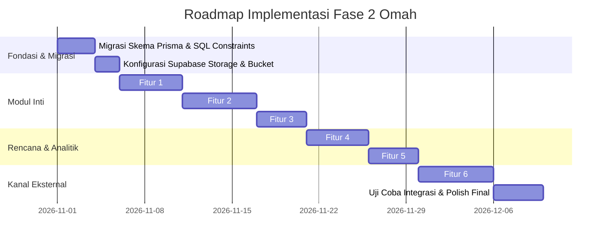

# 📋 Rencana Implementasi — Fitur Fase 2 (Ekspansi & Automasi Rumah Tangga)

**Project:** Omah (Sistem Manajemen Keluarga Privat) · **Versi PRD:** 0.6  
**Tanggal:** 2 Oktober 2026 · **Status:** Siap Dieksekusi setelah Fase 1 Stabil (≥ 2 Bulan Pemakaian)

---

## 📌 Prasyarat Aktivasi Fase 2 (Exit Gate Fase 1)

Sesuai **PRD §5 & §11**, Fase 2 baru boleh dimulai jika metrik keberhasilan Fase 1 terpenuhi:
1. **Konsistensi Pemakaian:** Kedua pasangan aktif mencatat pengeluaran ≥ 3 hari/minggu selama minimal 8 minggu berturut-turut.
2. **Kelengkapan Data:** ≥ 80% transaksi harian berhasil tercatat dan tidak ada tagihan terlewat (*zero missed bills*).
3. **Integritas Backup:** Backup mandiri database terenkripsi (`pg_dump`) sudah berjalan otomatis harian dan telah sukses diuji *restore* ke database kosong.

---

## 🗺️ Ringkasan Modul & Prioritas Fase 2

| # | Modul / Fitur | Prioritas | Estimasi | Kompleksitas | Dependensi Eksternal |
|---|---------------|-----------|----------|--------------|----------------------|
| **1** | **Brankas Dokumen Keluarga** (Vault) | 🔴 Tinggi | 6-8 jam | Sedang | Supabase Storage (Bucket privat) |
| **2** | **Aset, Garansi & Servis Kendaraan** | 🔴 Tinggi | 7-9 jam | Sedang | Transaksi (Kategori Maintenance) |
| **3** | **Catatan Angpao & Kondangan** (Social Ledger) | 🟡 Sedang | 5-6 jam | Sedang | Transaksi (Kategori Hadiah/Kondangan) |
| **4** | **Meal Planner Mingguan ➔ Daftar Belanja** | 🟡 Sedang | 6-8 jam | Sedang | Modul `shopping_lists` (Fase 1) |
| **5** | **Tren Keuangan & Analitik Tahunan** | 🟡 Sedang | 5-7 jam | Sedang | Recharts / Chart.js, Data Transaksi |
| **6** | **Kanal WhatsApp Pengingat (via WAHA)** | 🟢 Opsional | 8-10 jam | Tinggi | VPS / Docker host, Nomor WA khusus |

**Total Estimasi Pengerjaan: ~37 - 48 Jam Kerja (sekitar 4-6 minggu kerja santai/paruh waktu).**

---

## 🗄️ Ekstensi Skema Database Prisma (Fase 2)

Tambahan model di [`prisma/schema.prisma`](file:///d:/Project%20Website/project-omah/prisma/schema.prisma) untuk mendukung seluruh fitur Fase 2:

```prisma
// =============================================================================
// MODUL FASE 2: BRANKAS DOKUMEN, ASET, KONDANGAN, & MEAL PLANNER
// =============================================================================

enum DocumentCategory {
  IDENTITY     // KTP, KK, Akta Nikah, Paspor
  PROPERTY     // Sertifikat Tanah/Rumah, PBB, IMB
  VEHICLE      // BPKB, STNK
  INSURANCE    // Polis Asuransi Jiwa/Kesehatan/Mobil
  WARRANTY     // Nota & Kartu Garansi
  OTHER
}

enum AssetType {
  VEHICLE_CAR
  VEHICLE_MOTORCYCLE
  ELECTRONIC
  HOME_APPLIANCE
  JEWELRY_VALUABLE
  OTHER
}

enum KondanganType {
  RECEIVED // Angpao/kado yang diterima saat kita buat acara (pernikahan, khitanan, syukuran)
  GIVEN    // Uang/kado yang kita berikan saat menghadiri kondangan orang lain
}

enum MealSlot {
  BREAKFAST
  LUNCH
  DINNER
  SNACK
}

/// 1. Brankas Dokumen Terenkripsi / Privat
model DocumentVault {
  id           String           @id @default(dbgenerated("gen_random_uuid()")) @db.Uuid
  householdId  String           @map("household_id") @db.Uuid
  title        String
  category     DocumentCategory @default(OTHER)
  filePath     String           @map("file_path") // Path di Supabase Storage (household_id/...)
  fileSize     Int              @map("file_size") // Byte
  mimeType     String           @map("mime_type")
  description  String?
  expiryDate   DateTime?        @map("expiry_date") @db.Date
  reminderId   String?          @unique @map("reminder_id") @db.Uuid
  createdById  String           @map("created_by_id") @db.Uuid
  createdAt    DateTime         @default(now()) @map("created_at") @db.Timestamptz(3)
  updatedAt    DateTime         @updatedAt @map("updated_at") @db.Timestamptz(3)
  deletedAt    DateTime?        @map("deleted_at") @db.Timestamptz(3)

  household    Household        @relation(fields: [householdId], references: [id], onDelete: Cascade)
  createdBy    Profile          @relation(fields: [createdById], references: [id], onDelete: NoAction)
  reminder     Reminder?        @relation(fields: [reminderId], references: [id], onDelete: SetNull)

  @@index([householdId, category])
  @@map("document_vaults")
}

/// 2. Aset & Barang Berharga Rumah Tangga
model Asset {
  id              String            @id @default(dbgenerated("gen_random_uuid()")) @db.Uuid
  householdId     String            @map("household_id") @db.Uuid
  name            String
  type            AssetType         @default(OTHER)
  brandModel      String?           @map("brand_model")
  purchaseDate    DateTime?         @map("purchase_date") @db.Date
  purchasePrice   BigInt?           @map("purchase_price")
  serialNumber    String?           @map("serial_number")
  warrantyExpiry  DateTime?         @map("warranty_expiry") @db.Date
  licensePlate    String?           @map("license_plate") // Khusus kendaraan (mis. B 1234 CD)
  currentMileage  Int?              @map("current_mileage") // KM kendaraan terkini
  note            String?
  createdAt       DateTime          @default(now()) @map("created_at") @db.Timestamptz(3)
  updatedAt       DateTime          @updatedAt @map("updated_at") @db.Timestamptz(3)
  deletedAt       DateTime?         @map("deleted_at") @db.Timestamptz(3)

  household       Household         @relation(fields: [householdId], references: [id], onDelete: Cascade)
  serviceLogs     AssetServiceLog[]

  @@index([householdId, type])
  @@map("assets")
}

/// Log Servis / Perawatan Kendaraan & Elektronik
model AssetServiceLog {
  id            String    @id @default(dbgenerated("gen_random_uuid()")) @db.Uuid
  assetId       String    @map("asset_id") @db.Uuid
  householdId   String    @map("household_id") @db.Uuid
  serviceDate   DateTime  @map("service_date") @db.Date
  mileage       Int?      // KM saat servis
  serviceCenter String?   @map("service_center") // Nama bengkel / toko servis
  description   String    // Ganti oli, filter udara, tune up, dll.
  cost          BigInt    @default(0)
  transactionId String?   @unique @map("transaction_id") @db.Uuid
  nextDueDate   DateTime? @map("next_due_date") @db.Date
  nextMileage   Int?      @map("next_mileage")
  createdAt     DateTime  @default(now()) @map("created_at") @db.Timestamptz(3)
  updatedAt     DateTime  @updatedAt @map("updated_at") @db.Timestamptz(3)

  asset         Asset        @relation(fields: [assetId], references: [id], onDelete: Cascade)
  household     Household    @relation(fields: [householdId], references: [id], onDelete: Cascade)
  transaction   Transaction? @relation(fields: [transactionId], references: [id], onDelete: SetNull)

  @@index([assetId, serviceDate(sort: Desc)])
  @@map("asset_service_logs")
}

/// 3. Catatan Buku Tamu / Angpao / Kondangan
model KondanganRecord {
  id            String        @id @default(dbgenerated("gen_random_uuid()")) @db.Uuid
  householdId   String        @map("household_id") @db.Uuid
  type          KondanganType
  personName    String        @map("person_name") // Nama pemberi / yang punya hajat
  eventName     String        @map("event_name")  // "Pernikahan Budi & Ani", "Syukuran Rumah Joko"
  eventDate     DateTime      @map("event_date") @db.Date
  amount        BigInt?       // Nominal amplop jika uang
  giftItem      String?       // Nama barang jika kado non-uang (cth: Blender Philips)
  notes         String?
  transactionId String?       @unique @map("transaction_id") @db.Uuid // Terhubung ke pengeluaran jika GIVEN
  createdAt     DateTime      @default(now()) @map("created_at") @db.Timestamptz(3)
  updatedAt     DateTime      @updatedAt @map("updated_at") @db.Timestamptz(3)
  deletedAt     DateTime?     @map("deleted_at") @db.Timestamptz(3)

  household     Household    @relation(fields: [householdId], references: [id], onDelete: Cascade)
  transaction   Transaction? @relation(fields: [transactionId], references: [id], onDelete: SetNull)

  @@index([householdId, personName])
  @@index([householdId, eventDate(sort: Desc)])
  @@map("kondangan_records")
}

/// 4. Meal Planner Mingguan & Resep/Bahan Masakan
model MealPlan {
  id          String   @id @default(dbgenerated("gen_random_uuid()")) @db.Uuid
  householdId String   @map("household_id") @db.Uuid
  planDate    DateTime @map("plan_date") @db.Date
  slot        MealSlot @default(DINNER)
  dishName    String   @map("dish_name") // Misal: Sayur Sop + Ayam Goreng
  recipeUrl   String?  @map("recipe_url")
  ingredients Json?    // Array of string: ["Ayam 1/2 kg", "Wortel 2 buah", "Buncis 1 bungkus"]
  notes       String?
  isCooked    Boolean  @default(false) @map("is_cooked")
  createdAt   DateTime @default(now()) @map("created_at") @db.Timestamptz(3)
  updatedAt   DateTime @updatedAt @map("updated_at") @db.Timestamptz(3)

  household   Household @relation(fields: [householdId], references: [id], onDelete: Cascade)

  @@unique([householdId, planDate, slot])
  @@index([householdId, planDate])
  @@map("meal_plans")
}
```

---

## 🔬 Detail Rencana Implementasi Per Fitur

---

### Fitur 1: Brankas Dokumen Keluarga (Document Vault)

> **Referensi PRD:** §5 & §5.3 — "Brankas dokumen (Supabase Storage, enkripsi, akses berbasis household)."  
> **Tujuan:** Menyimpan salinan digital dokumen berharga (KTP, KK, Akta Nikah, Polis Asuransi, STNK, Sertifikat) dengan akses aman yang terisolasi per keluarga.

#### A. Arsitektur Storage & Keamanan
- **Bucket Supabase:** `household-vault` (Private, non-public bucket).
- **Struktur Path:** `${householdId}/${documentId}-${sanitizedFilename}`.
- **RLS Supabase Storage:**
  - Hanya user terautentikasi yang profilnya memiliki `household_id` yang sama yang dapat mengunduh / generate Signed URL (durasi expiry URL 60 detik).
  - Batasan ukuran: Maksimum 5 MB per file. Format: PDF, JPEG, PNG, WEBP.
- **Relasi ke Reminder:**
  - Jika dokumen memiliki masa berlaku (`expiryDate`, misal STNK atau Paspor), otomatis buatkan atau tautkan entitas `Reminder` (H-30, H-7) agar muncul di feed notifikasi.

#### B. File yang Perlu Dibuat / Diubah
| File | Aksi | Deskripsi |
|------|------|-----------|
| [`src/lib/data/vault.ts`](file:///d:/Project%20Website/project-omah/src/lib/data) | **Buat** | Data layer: `getVaultDocuments`, `createVaultDocumentRecord`, `deleteVaultDocument`, `getSignedDownloadUrl` |
| [`src/actions/vault-actions.ts`](file:///d:/Project%20Website/project-omah/src/actions) | **Buat** | Server Action: Validasi upload, upload ke Supabase Storage via admin client/signed upload, create DB record |
| [`src/app/(dashboard)/vault/page.tsx`](file:///d:/Project%20Website/project-omah/src/app) | **Buat** | Halaman utama brankas dokumen (grid dokumen per kategori + tombol upload) |
| [`src/components/vault/document-card.tsx`](file:///d:/Project%20Website/project-omah/src/components) | **Buat** | Kartu preview dokumen (badge kategori, tanggal kadaluarsa, tombol unduh/buka) |
| [`src/components/vault/upload-document-modal.tsx`](file:///d:/Project%20Website/project-omah/src/components) | **Buat** | Form modal upload: drag & drop, input nama, kategori, tanggal expired, auto-create reminder switch |

#### C. Acceptance Criteria
- [ ] Dokumen hanya dapat dibuka melalui pre-signed URL temporer yang valid 60 detik.
- [ ] User dari household lain mustahil mengakses path storage household lain (ditegakkan RLS Storage + App layer).
- [ ] Upload file > 5MB atau format selain dokumen/gambar ditolak dengan pesan jelas.
- [ ] Menyetel tanggal kadaluarsa dokumen opsional memicu pembuatan reminder jatuh tempo di sistem.

---

### Fitur 2: Aset, Garansi, & Riwayat Servis Kendaraan

> **Referensi PRD:** §5 — "Aset, garansi, riwayat servis kendaraan."  
> **Tujuan:** Melacak inventaris bernilai tinggi di rumah, tanggal kadaluarsa garansi produk, serta rekaman servis mobil/motor berkala agar tidak lupa ganti oli atau perpanjang uji berkala.

#### A. Alur Kerja & Integrasi Finansial
1. **Registrasi Aset:** Pengguna mendaftarkan aset (contoh: *Honda Vario 160*, *Kulkas LG Smart Inverter*, *Mesin Cuci Electrolux*).
2. **Riwayat Servis / Perawatan:**
   - Saat servis berkala (misal: servis 10.000 KM atau cuci AC 3 bulanan): pengguna mencatat kilometer, catatan tindakan, tanggal, dan biaya.
   - **Sinkronisasi Transaksi:** Terdapat opsi *checkbox* `"Catat biaya ke Pengeluaran"`. Jika dicentang, otomatis membuat transaksi `EXPENSE` pada dompet yang dipilih dengan kategori *Perawatan & Servis*.
3. **Prediksi Servis Berikutnya:** Pengguna dapat menentukan kilometer / tanggal servis berikutnya, otomatis membentuk entitas `Reminder`.

#### B. File yang Perlu Dibuat / Diubah
| File | Aksi | Deskripsi |
|------|------|-----------|
| [`src/lib/data/assets.ts`](file:///d:/Project%20Website/project-omah/src/lib/data) | **Buat** | Query daftar aset, hitung total valuasi aset, get riwayat servis per aset |
| [`src/actions/asset-actions.ts`](file:///d:/Project%20Website/project-omah/src/actions) | **Buat** | Server action tambah/edit aset, catat servis baru + transaksi auto-sync |
| [`src/app/(dashboard)/assets/page.tsx`](file:///d:/Project%20Website/project-omah/src/app) | **Buat** | Halaman katalog aset dan reminder servis mendatang |
| [`src/components/assets/asset-detail-modal.tsx`](file:///d:/Project%20Website/project-omah/src/components) | **Buat** | Modal rincian aset: timeline riwayat servis, no. seri, bukti nota/garansi |
| [`src/components/assets/add-service-log-modal.tsx`](file:///d:/Project%20Website/project-omah/src/components) | **Buat** | Form log servis: KM, bengkel, rincian biaya, toggle buat transaksi pengeluaran |

#### C. Acceptance Criteria
- [ ] Total valuasi perkiraan seluruh aset tampil di ringkasan modul aset.
- [ ] Riwayat servis kendaraan tersusun urut kronologis mundur lengkap dengan selisih KM antar-servis.
- [ ] Jika opsi "Catat ke transaksi" dipilih, saldo dompet otomatis berkurang dan tercatat di audit log.

---

### Fitur 3: Catatan Angpao & Kondangan (Social & Gift Ledger)

> **Referensi PRD:** §5 — "Catatan angpao/kondangan."  
> **Tujuan:** Menyimpan rekam jejak timbal-balik amplop/kado hajatan sosial (kebiasaan budaya Indonesia), sehingga keluarga tahu siapa saja yang memberi saat hajatan pribadi, dan berapa nominal yang pantas dikembalikan saat menghadiri hajatan mereka kelak.

#### A. Alur Kerja Logika Bisnis
1. **Dua Mode Utama:**
   - **Mode Diterima (RECEIVED):** Mencatat amplop/kado dari kerabat saat acara nikahan/syukuran keluarga.
   - **Mode Diberikan (GIVEN):** Mencatat amplop/kado yang kita berikan saat mendatangi hajatan orang lain.
2. **Pencarian Timbal Balik Cerdas (Reciprocal Lookup):**
   - Saat hendak kondangan ke "Pak Bambang", pengguna cukup mengetik nama di kolom pencarian.
   - Sistem menampilkan riwayat: *"Pak Bambang pernah memberikan amplop Rp 500.000 pada Pernikahan Anda (12 Des 2026)"*.
3. **Koneksi Transaksi:**
   - Pengeluaran amplop kondangan bisa langsung dikaitkan dengan transaksi `EXPENSE` kategori *Sosial & Donasi*.

#### B. File yang Perlu Dibuat / Diubah
| File | Aksi | Deskripsi |
|------|------|-----------|
| [`src/lib/data/kondangan.ts`](file:///d:/Project%20Website/project-omah/src/lib/data) | **Buat** | Query catatan angpao, search timbal-balik nama orang, total uang diterima vs dikeluarkan |
| [`src/actions/kondangan-actions.ts`](file:///d:/Project%20Website/project-omah/src/actions) | **Buat** | Server action catat angpao/kado baru, edit, hapus (soft delete) |
| [`src/app/(dashboard)/kondangan/page.tsx`](file:///d:/Project%20Website/project-omah/src/app) | **Buat** | Halaman catatan sosial & kondangan dengan tab "Diterima" dan "Diberikan" |
| [`src/components/kondangan/reciprocal-search.tsx`](file:///d:/Project%20Website/project-omah/src/components) | **Buat** | Komponen pencarian cepat nama kerabat untuk cek histori amplop timbal balik |

#### C. Acceptance Criteria
- [ ] Pencarian nama kerabat menampilkan histori amplop timbal-balik (pemberian vs penerimaan) secara instan.
- [ ] Ringkasan total amplop yang diterima dan total yang sudah dikeluarkan untuk kondangan ditampilkan dalam format mata uang Rupiah.

---

### Fitur 4: Menu Mingguan Terhubung ke Daftar Belanja (Meal Planner)

> **Referensi PRD:** §5 — "Menu mingguan terhubung ke daftar belanja."  
> **Tujuan:** Menghilangkan kebingungan harian *"hari ini masak apa?"* dengan perencanaan menu sarapan, makan siang, dan makan malam selama seminggu, yang bahan-bahannya bisa dimasukkan ke daftar belanja dalam satu klik.

#### A. Integrasi dengan Modul Belanja (Fase 1)
1. **Tampilan Kalender 7 Hari:** Grid Senin s/d Minggu dengan slot: Pagi (Sarapan), Siang (Makan Siang), Malam (Makan Malam).
2. **Daftar Bahan Makanan (Ingredients):** Setiap masakan memiliki daftar bahan mentah (contoh: *Sayur Bayam: Bayam 2 ikat, Jagung Manis 1 buah, Bawang Merah*).
3. **Ekspor Satu-Klik ke Belanjaan:**
   - Tombol **"🛒 Masukkan Bahan ke Daftar Belanja"**.
   - Pengguna memilih daftar belanja target (misal: `"Belanja Pasar"` atau `"Belanja Supermarket"`).
   - Sistem secara otomatis membuat entitas `shopping_items` yang belum dicentang (`checked: false`).
4. **Status Selesai Dimasak:** Tombol centang *Cooked* untuk menandai makanan telah selesai dimasak hari itu.

#### B. File yang Perlu Dibuat / Diubah
| File | Aksi | Deskripsi |
|------|------|-----------|
| [`src/lib/data/meal-plan.ts`](file:///d:/Project%20Website/project-omah/src/lib/data) | **Buat** | Query menu per rentang tanggal (Senin - Minggu), resep favorit, update status cooked |
| [`src/actions/meal-plan-actions.ts`](file:///d:/Project%20Website/project-omah/src/actions) | **Buat** | Server action tambah/edit menu harian, aksi batch push bahan ke `shopping_items` |
| [`src/app/(dashboard)/meals/page.tsx`](file:///d:/Project%20Website/project-omah/src/app) | **Buat** | View planner mingguan dengan navigator minggu (Previous / Next Week) |
| [`src/components/meals/meal-week-grid.tsx`](file:///d:/Project%20Website/project-omah/src/components) | **Buat** | Grid kartu hari Senin - Minggu dengan badge slot makan (Pagi/Siang/Malam) |
| [`src/components/meals/push-to-shopping-modal.tsx`](file:///d:/Project%20Website/project-omah/src/components) | **Buat** | Modal konfirmasi list bahan masakan yang akan di-insert ke tabel `shopping_items` |

#### C. Acceptance Criteria
- [ ] Pengguna dapat berpindah minggu dengan cepat dan menyusun rencana menu untuk 7 hari ke depan.
- [ ] Tombol "Kirim ke Belanja" mengecek item duplikat atau menyisipkan bahan masakan langsung ke daftar belanja real-time.
- [ ] Bahan yang sudah dikirim ke belanjaan langsung sinkron via Supabase Realtime di perangkat pasangan.

---

### Fitur 5: Laporan Tahunan & Tren Keuangan (Annual Reports & Financial Trends)

> **Referensi PRD:** §5 — "Laporan tahunan dan tren."  
> **Tujuan:** Memberikan sudut pandang makro terhadap kesehatan finansial keluarga setelah pemakaian berbulan-bulan (pola pengeluaran, perbandingan antar bulan, dan rasio tabungan tahunan).

#### A. Metrik & Visualisasi
1. **Grafik Tren Arus Kas 12 Bulan (Cashflow Trajectory):** Perbandingan batang/garis Pemasukan vs Pengeluaran per bulan.
2. **Tingkat Tabungan (Savings Rate %):** `((Pemasukan - Pengeluaran) / Pemasukan) * 100%` per bulan dan rata-rata tahunan.
3. **Analisis Kategori Pengeluaran Terbesar (Annual Donut/Bar Breakdown):** Melihat pos pengeluaran apa yang menyedot anggaran terbesar sepanjang tahun (misal: Cicilan Rumah, Makanan, Transportasi).
4. **Deteksi Lonjakan Musiman (Seasonal Outliers):** Menandai bulan dengan pengeluaran abnormal (Hari Raya, Liburan Akhir Tahun, Pajak PBB/Kendaraan).
5. **Ekspor Laporan Rangkuman:** Tombol ekspor laporan tahunan bersih dalam format PDF / CSV print-ready.

#### B. File yang Perlu Dibuat / Diubah
| File | Aksi | Deskripsi |
|------|------|-----------|
| [`src/lib/data/analytics.ts`](file:///d:/Project%20Website/project-omah/src/lib/data) | **Buat** | Agregasi data tahunan: per-month income/expense, category distribution, savings rate |
| [`src/app/(dashboard)/analytics/page.tsx`](file:///d:/Project%20Website/project-omah/src/app) | **Buat** | Halaman visualisasi laporan tahunan dengan selector tahun kalender (misal: 2026, 2027) |
| [`src/components/analytics/cashflow-chart.tsx`](file:///d:/Project%20Website/project-omah/src/components) | **Buat** | Visualisasi grafik batang pemasukan vs pengeluaran 12 bulan (Recharts / SVG Tailwind) |
| [`src/components/analytics/category-pie-chart.tsx`](file:///d:/Project%20Website/project-omah/src/components) | **Buat** | Visualisasi proporsi pengeluaran tahunan per kategori |
| [`src/components/analytics/savings-rate-card.tsx`](file:///d:/Project%20Website/project-omah/src/components) | **Buat** | Kartu statistik rasio tabungan rata-rata dan bulan paling hemat |

#### C. Acceptance Criteria
- [ ] Query analitik dijalankan efisien dengan agregasi SQL/Prisma tanpa meload ribuan baris transaksi mentah ke memory browser.
- [ ] Grafik responsif di layar ponsel maupun desktop dengan tooltip nominal Rupiah yang presisi.
- [ ] Tersedia ringkasan eksekutif: "Total Pemasukan Setahun", "Total Pengeluaran", "Total Bersih Tersimpan".

---

### Fitur 6: Kanal Pengingat WhatsApp via WAHA (WhatsApp HTTP API)

> **Referensi PRD:** §5, §6.6, §8.3 & §13 — "Kanal WhatsApp untuk pengingat lewat WAHA, diimplementasikan sebagai `NotificationChannel` tambahan."  
> **Tujuan:** Mengirim pengingat tagihan dan peringatan anggaran langsung ke WhatsApp suami dan istri melalui bot WAHA mandiri.

#### A. Arsitektur & Manajemen Risiko (PRD §8.3)
1. **Nomor Khusus:** Wajib menggunakan kartu SIM/nomor WhatsApp khusus bot (bukan nomor pribadi) untuk mengisolasi risiko pemblokiran Meta.
2. **Infrastruktur WAHA:**
   - Menjalankan container Docker `devlikeapro/waha` (Core gratis) di server mini/VPS atau Docker host yang menyala 24/7.
   - Sesi terproteksi dengan `WAHA_API_KEY`.
3. **Desain Fallback Multi-Channel:**
   - Menggunakan interface `NotificationChannel` yang sudah dirancang sejak Fase 1.
   - **Prinsip Isolasi Kegagalan:** Jika server WAHA mati atau sesi QR terputus, kegagalan WhatsApp **TIDAK BOLEH** menggagalkan notifikasi Telegram harian.
   - Pengiriman dicatat mandiri di `notification_logs` dengan `channel = WHATSAPP`.
4. **Isi Pesan Minimal:** Sama seperti Telegram, isi pesan ringkas dan sopan, tanpa mengekspos rincian saldo rahasia.

#### B. File yang Perlu Dibuat / Diubah
| File | Aksi | Deskripsi |
|------|------|-----------|
| [`src/lib/notifications/waha-channel.ts`](file:///d:/Project%20Website/project-omah/src/lib/notifications) | **Buat** | Implementasi `NotificationChannel` untuk WAHA HTTP API (REST client + API Key) |
| [`src/lib/notifications/dispatcher.ts`](file:///d:/Project%20Website/project-omah/src/lib/notifications) | **Ubah** | Tambah `WahaWhatsAppChannel` ke pipeline broadcast notifikasi |
| [`src/app/api/webhooks/whatsapp/route.ts`](file:///d:/Project%20Website/project-omah/src/app/api/webhooks) | **Buat** | Webhook penerima balasan pesan WhatsApp (perintah `/saldo`, `/tagihan`, `/bantuan`) |
| [`src/components/settings/whatsapp-link-modal.tsx`](file:///d:/Project%20Website/project-omah/src/components/settings) | **Buat** | Modal penautan nomor WhatsApp dengan kode verifikasi 6 digit |
| [`docker-compose.waha.yml`](file:///d:/Project%20Website/project-omah) | **Buat** | File docker-compose referensi untuk deployment WAHA di VPS/lokal |

#### C. Acceptance Criteria
- [ ] Pengiriman pesan ke WhatsApp sukses menerima status 200 dari WAHA.
- [ ] Jika WAHA offline/unreachable, log status tercatat `FAILED` di `notification_logs`, dan proses cron tetap berlanjut menyelesaikan notifikasi Telegram tanpa throw exception.
- [ ] Pengguna dapat menautkan nomor WA melalui OTP 6 digit yang valid selama 15 menit.

---

## 🛠️ Navigasi & Integrasi UI (Starbucks Heritage Theme)

Semua halaman baru Fase 2 mengadopsi tema desain yang telah disepakati: **Starbucks Heritage Theme** (Warm Cream, Deep Forest Green `#1E3932`, House Green `#00754A`, Gold/Warm Accent `#CBA258`, dan kartu bertepi halus).

### Penataan Navigasi Bawah / Menu Utama:
- **Tab 1: Ringkasan (Dashboard)** (Finansial, Transaksi Cepat, Belanja & Tugas)
- **Tab 2: Rencana (Meals & Tasks)** (Meal Planner Mingguan & Pembagian Tugas Rumah)
- **Tab 3: Brankas (Vault & Aset)** (Dokumen Keluarga, Garansi, Servis Kendaraan)
- **Tab 4: Sosial (Kondangan)** (Catatan Angpao & Timbal Balik Kerabat)
- **Tab 5: Laporan & Pengaturan** (Tren Tahunan, Budget Settings, Kanal WA/Telegram)

---

## 📅 Roadmap Tahapan Eksekusi Fase 2



---

## 🔒 Checklist Keamanan & Aturan Data Access (Wajib Diikuti)

1. **Aturan Filter Household:** Setiap *Server Action* dan *Data Access Layer* pada tabel baru (`document_vaults`, `assets`, `kondangan_records`, `meal_plans`) **HARUS SELALU** menyertakan klausul `WHERE household_id = session.householdId`. Tidak boleh mengambil ID dari input user tanpa pengecekan kepemilikan.
2. **Pembersihan File Storage:** Saat dokumen di brankas dihapus, file biner di Supabase Storage wajib dihapus melalui API storage server untuk menghemat kuota free-tier 1 GB.
3. **Data Nominal Rupiah:** Semua nominal di tabel baru (`purchase_price`, `cost`, `amount`) menggunakan tipe data `BigInt` (tanpa desimal) dan dikonversi ke format angka Javascript aman di data layer.
4. **Isolasi WhatsApp:** WAHA dijalankan dengan token otorisasi ketat, dan bot tidak melayani pesan dari nomor asing selain nomor suami dan istri yang terdaftar di `notification_channels`.
